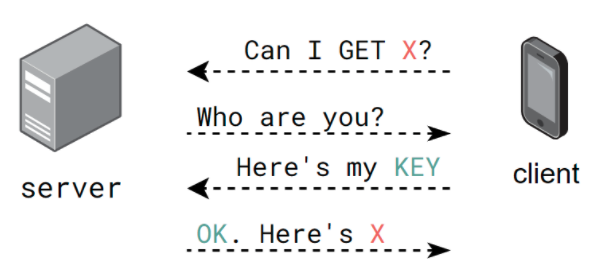

# Intro to APIs
## Background

1. What does **HTTP** stand for, and what does it mean in the context of the _internet_?
2. What is the relationship between a **server** and **clients**?
3. In the context of this diagram and APIs, what is a **URL**?
4. In the context of this diagram and APIs, what is an **endpoint**?

## Server-Client Communication
Let's examine an interaction between a server and a client.

1. How does the server know who the client is?
2. Why does the server need a `KEY` before sending `X`?
3. The server and client are communicating via HTTP (Hyper _Text_ Transfer Protocol). What format will the requested `X` be sent as?

## Data Transfer
### Review
Examine the following Python dictionary.
```py
pokemon = {
    'name': "Scolipede",
    'height': 25,
    'types': [
        {
            'slot': 1,
            'type': "bug"
        },
        {
            'slot': 2,
            'type': "poison"
        }
    ]
}
```
1. What does `pokemon['name']` evaluate to?
2. What does `pokemon['types'][0]` evaluate to?
3. Write Python code that accesses the `height`.
4. Write Python code that accesses the `type` in slot 2.

### JSON
1. What does **JSON** stand for? Why is it useful for **REST** APIs?

Examine the following **Javascript object**.
```js
pokemon = {
    'name': "Scolipede",
    'height': 25,
    'types': [
        {
            'slot': 1,
            'type': "bug"
        },
        {
            'slot': 2,
            'type': "poison"
        }
    ]
}
```

2. What does `pokemon['name']` evaluate to?
3. How would you access the `type` in slot 2?
4. How is a Javascript object different than a Python dictionary?

## Consuming APIs With Python
Let's return to this diagram:  
  
and accompany it with some Python code:
```python
import requests
BASE_URL = "http://www.server.com/"
ENDPOINT = "endpoint"
API_KEY = "abcd1234"

payload = {'key': API_KEY, 'q': "X"}

response = requests.get(BASE_URL+ENDPOINT, params=payload)
if response.ok:
    data = response.json()
else:
    print(reponse.status_code, response.text)
```

1. What is the **requests** module used for?
2. What parameters does the `get` method take?
3. What is a **payload** in the context of APIs?
4. We can now treat `data` as a Python dictionary. Why is that allowed?
5. How do we check if the response is OK?
6. What do we do if the response is not OK?
7. What is an HTTP **status code**?