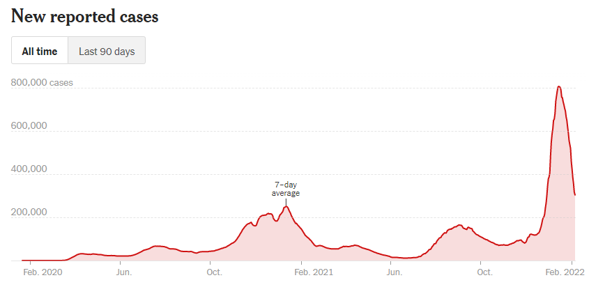
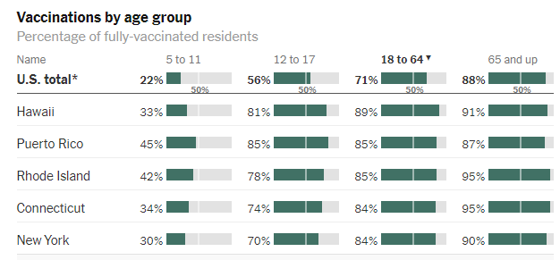
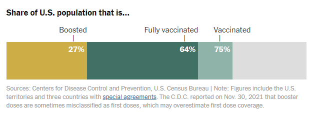
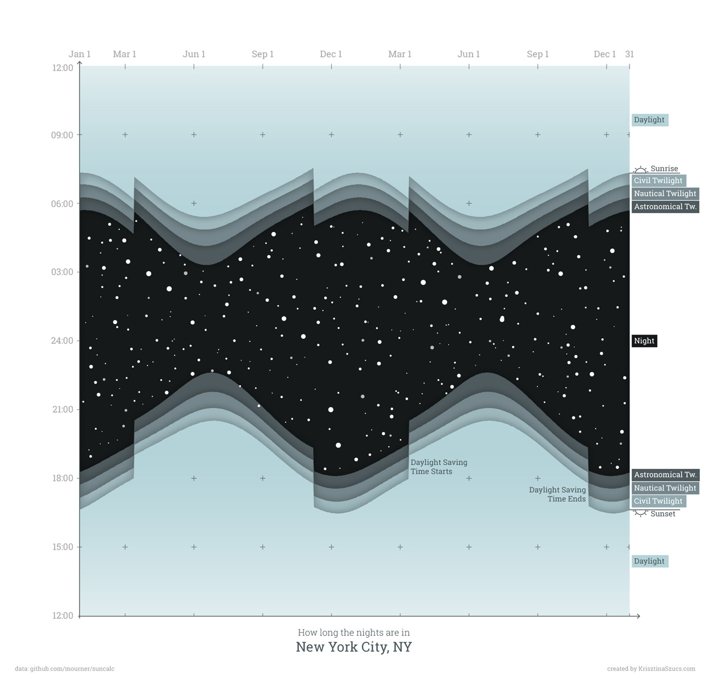

  # Data Viz Analysis Practice

  For each of the following visualizations, answer the following questions:
  1. What variables are shown in this visualization?
  2. Identify the marks and the scale that is being used (i.e. which variable -> which channel).
  3. What is the purpose of the visualization?
  4. Is the visualization effective? Elaborate.

## Figure 1

## Figure 2

## Figure 3

## Figure 4

> STOP! Wait for further instruction before moving onto the next section.

## Making Your Own
Number the following steps in order from 1-7.
  - Make the visualization
  - Decide which scales and channels to use for your marks
  - Record the types & relationships between the variables
  - Choose the variables you want to visualize
  - Analyze your data
  - Choose the appropriate type of chart and marks
  - Decide on the goal of your visualization (e.g. what message you want to convey)