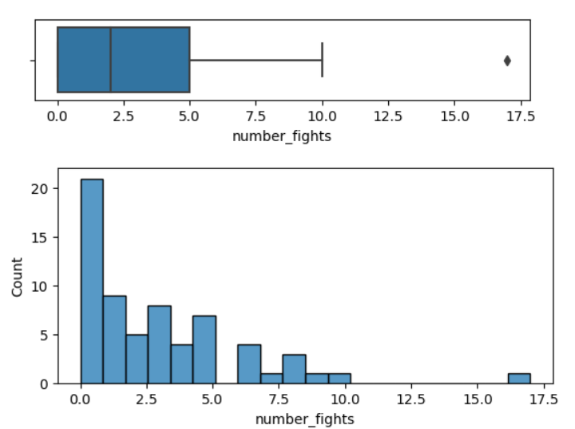
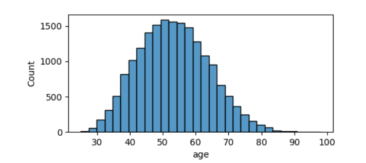
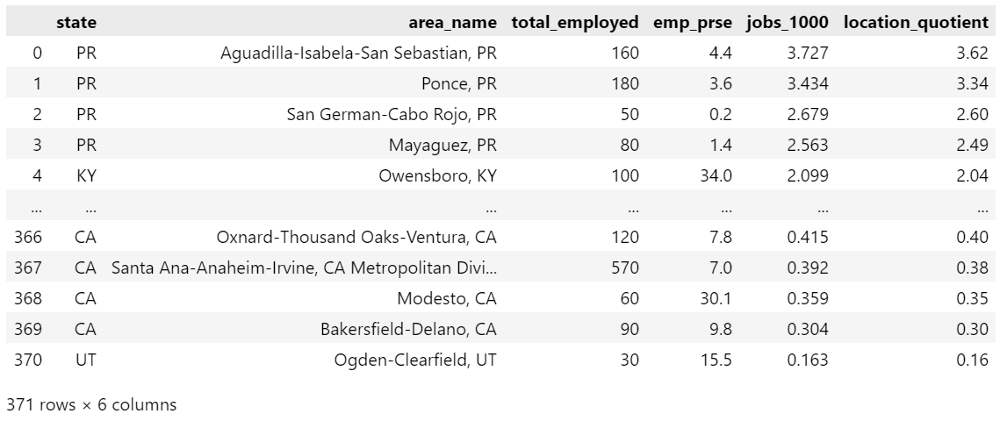

# Descriptive Stats & Viz Review

1. These charts summarize a dataset about college fight songs — specifically, the number of times the word “fight” appears in each song. The box plot is missing a left whisker because $Q0 = Q1 = 0$. Using the $1.5IQR$ rule, would an observation of 16 be considered an outlier? If so, would you consider that a false positive? Explain.

 
2. What do these quartiles tell us about the *shape* and *spread* of the distribution? Explain.

| Q0  | Q1  | Q2  | Q3  | Q4  |
| :-: | :-: | :-: | :-: | :-: |
| 10  | 21  | 28  | 37  | 50  |

3. This histogram is built from a dataset of every member of congress who served at any point between January 1947 and February 2014. It examines the age of each congressperson. Describe this distribution. Be thorough!

 
4. Examine the following contingency table and fill in the conditional proportions accordingly. Based on this information, do you think there exists an association between enjoying sports and liking candy? Explain.

|                       | Likes candy | Dislikes candy | Total |
| :-------------------: | :---------: | :------------: | :---: |
|     Enjoys sports     |     239     |      128       |  367  |
| Does not enjoy sports |     158     |       91       |  249  |

|                       | Likes candy | Dislikes candy | Total |  n  |
| :-------------------: | :---------: | :------------: | ----- | :-: |
|     Enjoys sports     |             |                | 1.0   | 367 |
| Does not enjoy sports |             |                | 1.0   | 249 |

 

5. `total_employed` is the number of librarians in the respective area. Describe a visualization that would support an answer to the following question. Explain any decisions you make, including (but not limited to) marks, channels, and labels.

   > How many librarians are employed in each area?

6. `location_quotient` measures the proportion of librarians to total population, specifically, per 1000 people. Describe a visualization that would support an answer to the following question. explain any decisions you make, including (but not limited to) marks, channels, and labels.

   > Is there a relationship between state and location_quotient? i.e. Are librarians more common in some states than others?
