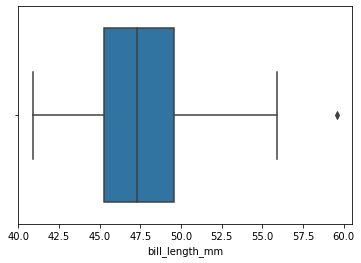
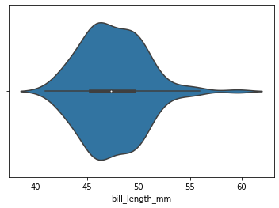

# Center and Variability

## Center
1. Define **mean**, **median**, and **mode**.
2. When people talk about taking an average, which **measure of center** are they usually referring to?
3. What is an **outlier**, and which measure of center does it affect the most?
4. if the **median** is greater than the **mean**, what does that tell you about the _skew_ of the distribution?
5. Give an example of a situation where finding the **mode** of a dataset would be useful.
6. Two datasets have the same **mean** of 1.15. Are these two datasets the same? Why or why not?

## Variability
The **variability** of a dataset is also called its **spread**.

### Range
We will be examining the bill lengths of Gentoo penguins (again). Make sure you have Python code to read and analyze `penguins.csv`

1. What is the **range** of a dataset, and what is the **range** of Gentoo bill lengths?
2. For this question, let's introduce a new datapoint: a bill length of `80.2`
   1. Does the range change, and if so, what is the new range?
   2. How will this affect the mean, median, and mode?
3. For this question, let's introduce 30 new observations, all with bill length `48.1`
   1. Does the range change, and if so, what is the new range?
   2. How will this affect the mean, median, and mode?
4. Based on your answers above, when do new data points affect the range?
5. What does the range tell us about a dataset, and what _doesn't_ it tell us?

### Percentiles and Quartiles
1. What is a **percentile**, and is it a single point or an interval?
2. What is a **quartile**?
3. Why is the median sometimes called the **2nd quartile (Q2)**?
4. Examine the following table. What can you tell about the _shape_ of this distribution?
    | Q0 | Q1 | Q2 | Q3 | Q4 |
    |:--:|:--:|:--:|:--:|:--:|
    |0|4|7|9|10|

### IQR and Basic Visualizations
Shown below is a **box plot** of Gentoo bill lengths.

1. Where do the **whiskers** extend to?
2. What percentage of the dataset is represented by the **box**?
3. What is an **interquartile range (IQR)**?
4. Any observation that is `1.5*IQR` below Q1 or above Q3 is marked as a _potential_ outlier.
   1. How is this displayed in the box plot? Show the math necessary to determine that datapoint is an outlier.
   2. The `1.5IQR` rule can give a false positive; that is, a datapoint that is marked as an outlier even when it isn't one. Describe an example where that happens.

Shown below is a **violin plot** for the same data.

1. How do the **box and whiskers** of a violin plot differ from those of a box plot?
2. What information does a violin plot provide that a box plot doesn't?
3. When would we want to use a violin plot over a box plot?

### Deviation
1. What is a datapoint's **deviation** in relation to the dataset mean?
2. What is a dataset's **standard deviation**?
3. What is the standard deviation of Gentoo bill lengths?
4. What is an observation's **z-score**, and how is that related to a dataset's standard deviation?
5. Why might **z-score** be a better measure than deviation?