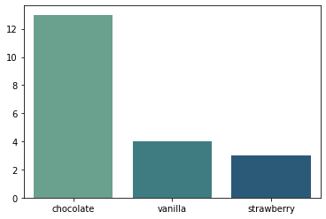
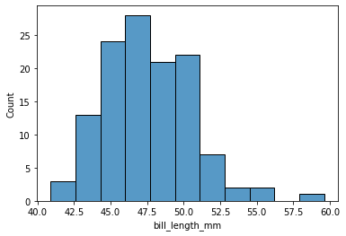
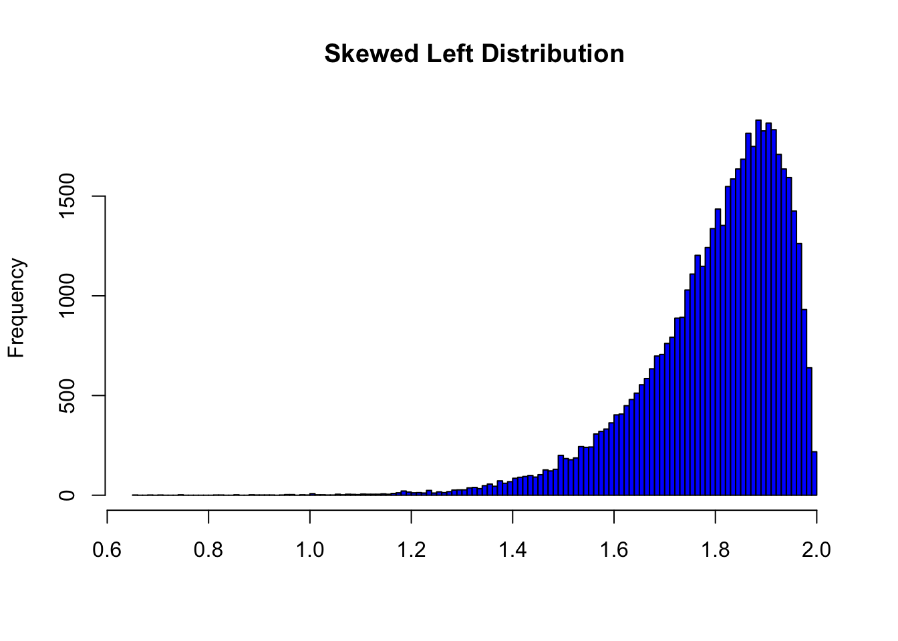

# Descriptive Statistics

## Definitions
**Descriptive statistics** is also called **summary statistics**, and as the name implies, is the study of _describing_ datasets.

1. Descriptive stats can only be applied to samples and _not_ populations. Why do you think that is?
2. Why can't we use descriptive stats to make conclusions about a population?
3. Some measures you may already be familiar with include the **mean** and **mode**. What information is captured by those numbers, and what information is lost?

## Describing Qualitative Data
Examine the dataset `icecream.csv` on Google Classroom, which is collected for the question:  
"What is a high school student's favorite ice cream flavor?"

1. Identify the population of the posed question.
2. Identify a feasible sampling frame.
3. Is this data _ordinal_ or _nominal_? Explain.
4. Using your answer above, explain why it would _not_ make sense to find the _mean_ ice cream flavor. Would it make sense to find the mode?

### Frequency Distributions
1. What is a **frequency distribution**?
2. How could we represent a frequency distribution in Python? Use `icecream.csv` as an example.

One way of visualizing frequency distributions is by creating a **categorical bar chart**. These are sometimes referred to as **Pareto charts** (but not in this class.)

#### Categorical Bar Charts

1. What do the **x** and **y axes** represent?
2. What information does this **categorical bar chart** quickly tell us about the dataset?
3. What information from the original dataset is lost in this chart?

## Describing Quantitative Data
Let's review `penguins.csv`; this time, we'll look only at the bill lengths of Gentoo penguins.

1. Write a Python file to read in `penguins.csv` and create a list of Gentoo penguin bill lengths (or reuse code from before.) What is the **mean** bill length?

penguins[penguins["species"]=="Gentoo"]["bill_length_mm"].mean()

2. It can be useful to visualize the frequency distribution of quantitative data as well. One approach is to make a categorical bar chart, with each different value as a category. Why is that not a good idea?

### Histograms

This is a **histogram** of Gentoo bill lengths.

1. What is a **histogram**? How is each bar labeled, and what does the height of the bar represent?
2. Why is this a better approach than a categorical bar chart?
3. What would happen if we made the intervals bigger? Smaller?

#### Distribution Shape
Let's look at something called a **normal distribution**, which we will define formally in the future.

1. How would you describe the **shape** of this distribution? What do you see?
2. Where is the **mode** of the distribution (visually)?
3. What is the difference between a **unimodal** and a **bimodal** distribution? What would a **bimodal** distribution look like?

4. The histogram above **skews** left, which means its **tail** stretches very long to the left. What would a **right-skewed** distribution look like?