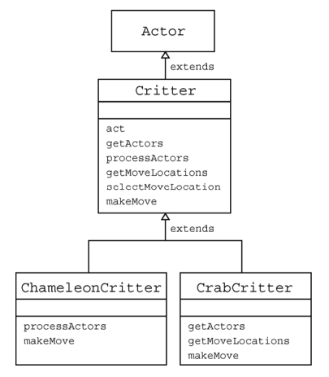

# Gridworld Interactions
## Case Study
This section is based on the [CollegeBoard GridWorld Student Manual](https://secure-media.collegeboard.org/apc/GridWorld_Case_Study_Student_Manual_with_Appendixes_Aug_2007_updated.pdf) (with modifications). Feel free to flip through this document!

For this problem set, we will be studying the `critters` demo project. Use that code and the source code in `gridWorld` to answer the following questions.

### Critter
1. What is an `ArrayList`?
2. What are the five basic actions common to all critters when they act?
> _Note:_ It is usually not a good idea to override the `act` method in a `Critter` subclass; if you find it unsuitable, consider extending `Actor` instead.
3. Should subclasses of Critter override the `getActors` method? Explain.
4. What three methods must be invoked to make a critter move? Explain each of these methods.
5. Why is there no `Critter` constructor?
6. What does a `Critter` do when it calls `processActors`? What is removed, and how?

The following image describes the relationship between `Critter` and its super/subclasses.

### ChameleonCritter
7. Why does `act` cause a `ChameleonCritter` to act differently from a `Critter` even though `ChameleonCritter` does not override `act`?
8. Explain `super.makeMove`, which appears in the `makeMove` method of `ChameleonCritter`.
9. Why doesn't `ChameleonCritter` override the `getActors` method?
10. Which class contains the `getLocation` method?
11. How can a `Critter` access its own grid?

### CrabCritter
12. Which neighbors does a `CrabCritter` eat, and how does it move?
13. Why doesn't `CrabCritter` override the `processActors` method?
14. Explain how `getActors` works.

## Problem Set #2: Beach Creatures
Create a project named `beachCreatures`. Be sure to add it to the source path as well so you can run the project via VS Code. The creatures should behave as described. You **do not** have to submit your runner; however, you should make sure that these creatures behave correctly in a `BoundedGrid`.

Each creature also has a corresponding `.gif` that is 48x48 pixels. These image files must be in the same folder as the class file if you want them to be used.

> _Note:_ You may have noticed that Actors automatically turn blue. If you do not want that to happen, call `setColor(null)` in the constructor to use an unmodified image.

You **do not** need to override each method for the Chameleons; your first step should be to decide which of the five methods (`getActors`, `processActors`, `getMoveLocations`, `selectMoveLocation`, `makeMove`) should be changed to get the desired result.

1. `LonelyChameleon` extends `ChameleonCritter` and behaves exactly like `ChameleonCritter`, except when there are no actors around it, it will darken (like a flower).
2. `NearsightedChameleon` extends `LonelyChameleon` and can only look in front or behind it when changing colors.
_Hint:_ you will need to look at `Location` to figure out how to access the specific tiles.

3. `TownCrier` extends `Critter` and thrives off attention. It looks at all neighbors within 2 tiles away and counts the number of `Critters`. If that number is greater than some threshold `t`, it will turn green. Otherwise, it will turn red. `t` is a parameter in the constructor. _Hint:_ use its `Location` to find all Critters in its range. Use `instanceof` to check if an actor is a `Critter`.
4. `AngryCrab` extends `CrabCritter` and causes all adjacent `Actor`s to move one step further away from the `AngryCrab`. If the actor cannot move away, the `AngryCrab` removes it from the grid. Once `AngryCrab` has completed processing the actors, it moves like a `CrabCritter`.

For the following classes, you should use `putSelfInGrid` and `removeSelfFromGrid` instead of `put` and `remove` to manipulate `Rock`s.

5. `RockMason` will try to spawn up to 2 `Rock`s in an empty adjacent location. If it is surrounded, then it will dig underground and emerge at a random unoccupied location in the world. If there are no unoccupied locations, then it will sit and wait until there is one. `RockMason` cannot build and move in the same turn.
6. `RockHound` loves to eat `Rock`s (i.e. removes rocks from the world), and can reach any rock that is adjcaent to it. If it cannot reach a rock, it will turn toward a rock in the world and move in that direction. If there are no rocks in the world, then it will sit and wait until there is one. `RockHound` cannot eat and move in the same turn.
7. Explain why `RockMason` and `RockHound` will eventually freeze if they are in the same world. (So you should first test them separately!)
      1. What changes could you make to their behavior to prevent this from happening?
